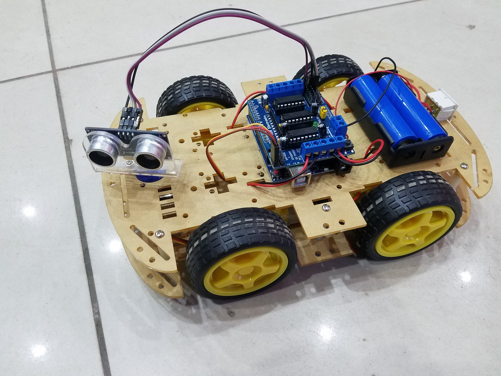
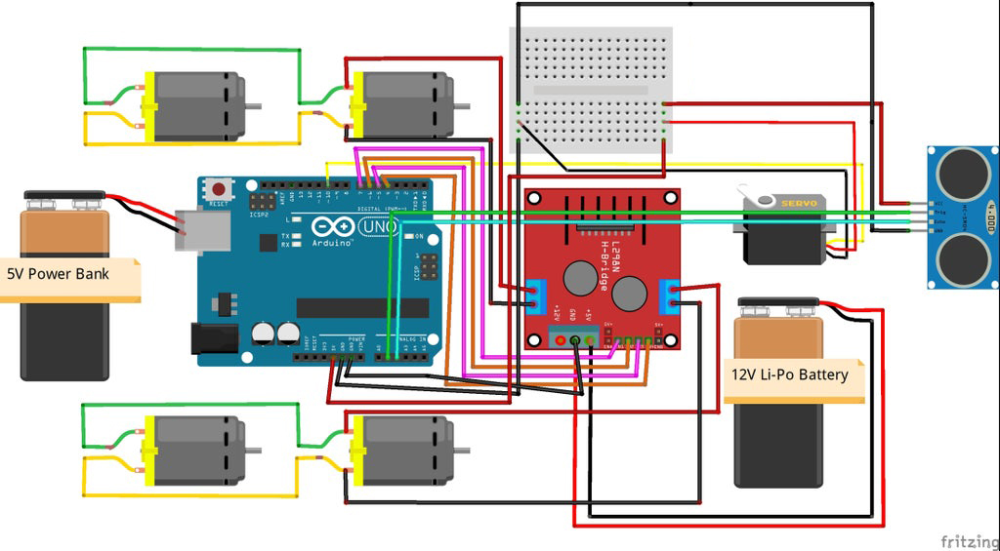
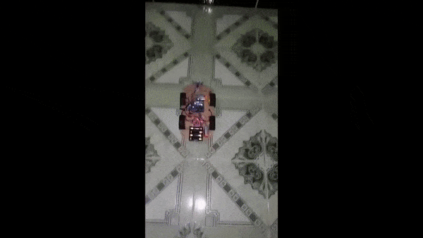

# Obstacle Avoiding Car

## Introdution

An Obstacle Avoidance car is an intelligent robot, which can automatically sense and overcome obstacles on its path. It contains of a Microcontroller to process the data, and Ultrasonic sensors to detect the obstacles on its path. Obstacle avoidance is one of the most important aspects of mobile robotics.

This obstacle-avoiding car is using the Arduino microcontroller as its main motherboard including some sensors and electronic modules. It uses the L298N H-Bridge driver to control the 4 wheels of motors. The design diagram is given below.

## Components

1) Arduino Uno
2) L298N motor drive
3) Wheels (4x)
4) TT Gear Motor (4x)
5) Servo Motor
6) Ultrasonic Sensor
6) 18650 Li-on Battery (2x)
7) 18650 Battery Holder
8) Male and Female Jumper wire
9) Acrylic car floor
10) DC Power Switch

## Diagram

## Demo

# Contact

### Website: 

### Social Media:

